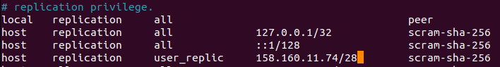
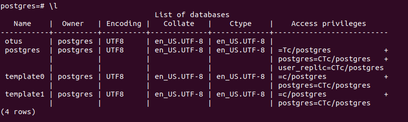
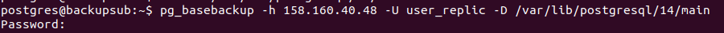
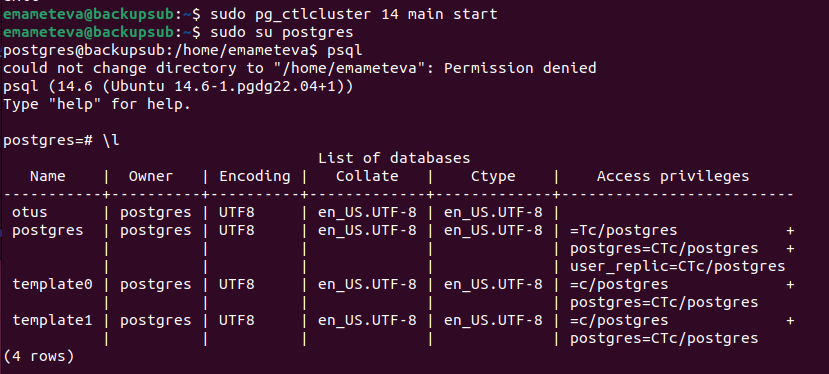

# Replication
* Создадим 4ВМ  
158.160.11.74 для бэкапа (протокол replica)  
158.160.43.123 для двух подписок (для таблиц test и test2, название подписок test_sub/test2_sub по протоколу logical)  
158.160.40.48 на нем таблица test  
51.250.2.165 на нем test2  

## Бэкап
* Сначала сделаем бэкап. Создадим роль user_replic с правами REPLICATION, LOGIN, PASSWORD.  
wal_level replica на обе машины.  
* Настроим pg_hba.conf  
host    replication     user_replic     158.160.11.74/28        scram-sha-256
  

* Список ДБ:  

* На реплике удаляем каталог /var/lib/postgresql/14/main  
Прописываем pg_basebackup -h 158.160.40.48 -U user_replic -D /var/lib/postgresql/14/main (указываем адрес мастера)

    
    

Готово!

## Логическая репликация

