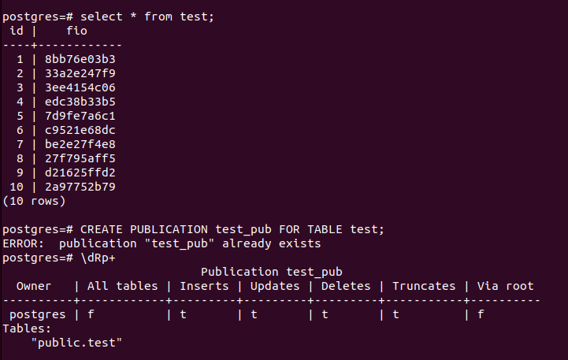
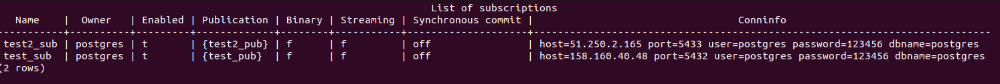
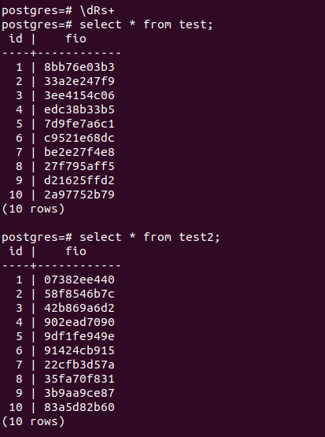

# Replication
* Создадим 4ВМ  
158.160.11.74 для бэкапа (протокол replica)  
158.160.43.123 для двух подписок (для таблиц test и test2, название подписок test_sub/test2_sub по протоколу logical)  
158.160.40.48 на нем таблица test  
51.250.2.165 на нем test2  

## Бэкап
* Сначала сделаем бэкап. Создадим роль user_replic с правами REPLICATION, LOGIN, PASSWORD.  
wal_level replica на обе машины.  
* Настроим pg_hba.conf  
host    replication     user_replic     158.160.11.74/28        scram-sha-256
  

* Список ДБ:  

* На реплике удаляем каталог /var/lib/postgresql/14/main  
Прописываем pg_basebackup -h 158.160.40.48 -U user_replic -D /var/lib/postgresql/14/main (указываем адрес мастера)

    
    

Готово!

## Логическая репликация

* Нам нужен wal_level = logical на 3х машинах (на одной у нас будет две подписки, которые находятся на двух машинах).

* 1ВМ - создадим таблицу test (заодно создаем такую же таблицу, с такой же структурой на 3ВМ без внесения данных). Создадим публикацию test_pub.
**CREATE PUBLICATION test_pub FOR TABLE test;**

  

* 2ВМ - аналогичным образом создадим публикацию test2_pub.
**CREATE PUBLICATION test2_pub FOR TABLE test2;**

* Создаем две подписки на 3ВМ  

**CREATE SUBSCRIPTION test2_sub**
**CONNECTION 'host=51.250.2.165 port=5433 user=postgres password=123456 dbname=postgres'** 
**PUBLICATION test2_pub WITH (copy_data = true);**

**CREATE SUBSCRIPTION test_sub 
CONNECTION 'host=158.160.40.48 port=5432 user=postgres password=123456 dbname=postgres' 
PUBLICATION test_pub WITH (copy_data = true);**

 

Т.к. мы указали copy_data = true то все данные должны перенестись на 3ВМ, проверяем.

 

